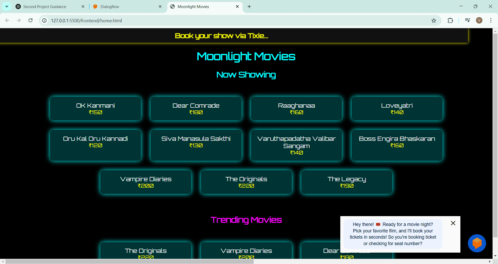
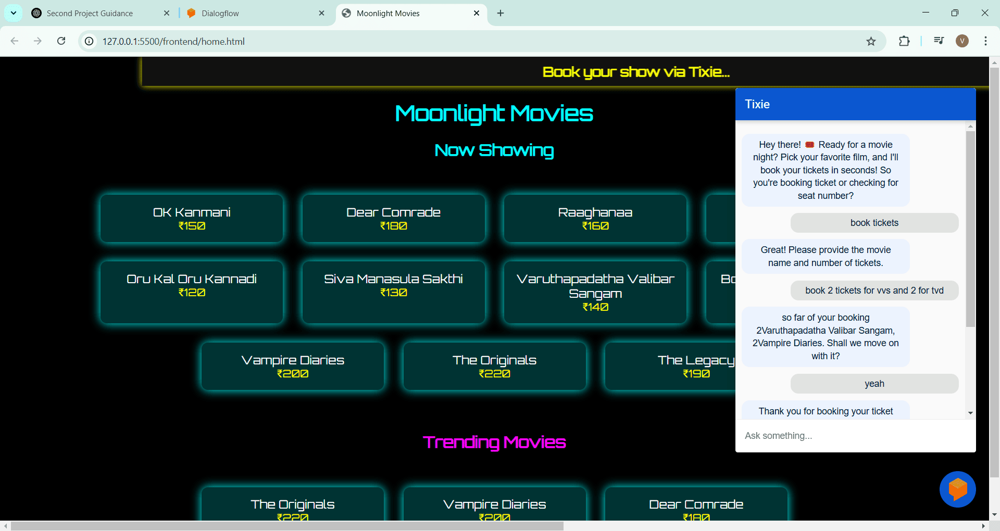
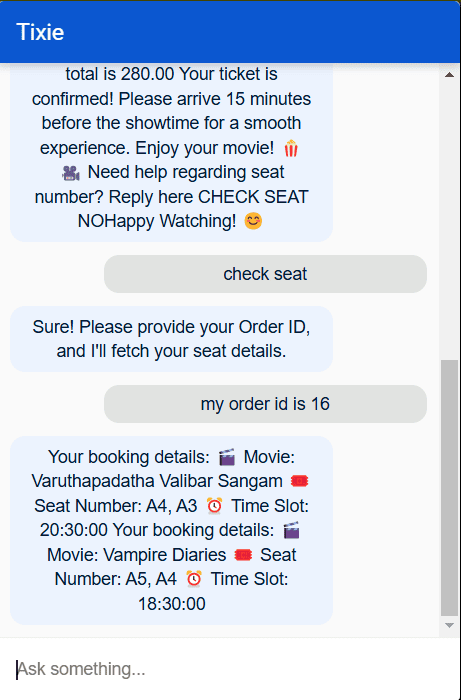

### ChatBot Tixie
## 🌙 Moonlight Movies - Movie Ticket Booking System 🎬
Welcome to Moonlight Movies, an interactive movie ticket booking website that allows users to **browse movies, check prices, book tickets, and retrieve seat numbers** using an **AI-powered chatbot.**

## Features
- **Movie Listings** - Displays available movies with their ticket prices.
- **Chatbot Integration** - Users can interact with a chatbot to book tickets and check seat numbers.
- **Order Management** - Retrieve seat details using an Order ID provided after booking.
- **Database Storage** - All booking and movie details are stored securely in MySQL.
- **FastAPI Backend** - High-performance backend built using FastAPI.

## Tech Stack
- **Frontend:** HTML, CSS  
- **Backend:** FastAPI (Python)  
- **Database:** MySQL  
- **Chatbot:** Dialogflow  

## How It Works
Visit the Moonlight Movies website.
Browse available movies along with ticket prices.
Click on the Chatbot to initiate a conversation.
The chatbot will guide you through the ticket booking process.
Once booked, an Order ID will be generated.
Use the Order ID to check seat details via the chatbot.

---
## 📸 Screenshots
# Home page

# Book tickets

# Check seat

